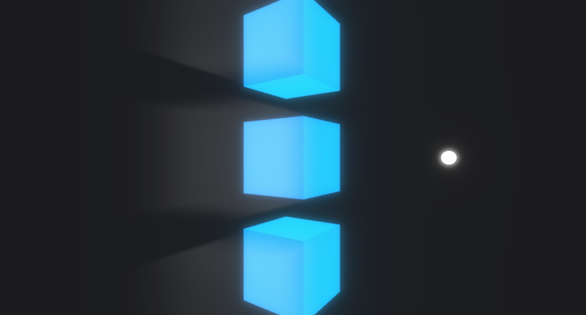

# URP Sun Shafts
A URP port of Unity's classic Standard Assets Effects package's Sun Shaft effect.

The effect is subtle, but when done well, it looks really nice!

## Heads Up
This asset was created with URP 10.3.2, but it should work on any version of URP that has custom renderer feature capabilities.

## Install
Download the latest version from [Releases](https://github.com/ryanslikesocool/URP-Sun-Shafts/releases/tag/v1.0).  Open the Unity project you want the package installed in.  Open the package to install into the project's Plugins folder.

## Usage
- In your Forward Renderer asset, add the Sun Shafts render feature.  Add the URP Sun Shafts material to the material field.
- `Pass Event` controls when the feature will render.  Please leave this at `Before Rendering Post Processing`.
- `Opacity` controls the opacity of the entire effect.
- `Resolution` controls how large the render textures created are.  `High` is full size, `Normal` is 1/4th size, and `Low` is 1/16th size.
- `Blend Mode` controls how the effect is blended on top of the scene.  There are only `Screen` and `Add` blend modes.
- `Sun Position` controls the position of the sun in world space.  It's recommended to put this whereever your main light is located.
- `Radial Blur Iterations` controls how many times the render texture is resampled.  A larger number will give a nicer result.
- `Sun Color` controls the color of the sun and the shafts.
- `Sun Threshold` controls how light the scene can be for shafts to still appear.  This takes some trial and error to get the value right.  Grayscale values tend to work best.
- `Sun Blur Radius` controls how blurry the shafts will be.
- `Sun Intensity` controls how intense the sun is.  This can be treated like an HDR modifier.
- `Max Radius` controls the maximum size of a sun shaft.
- `Use Depth Texture` controls whether or not the feature will use the camera depth texture, enabled in the URP asset.  Disabling it is only recommended if you have a skybox.
